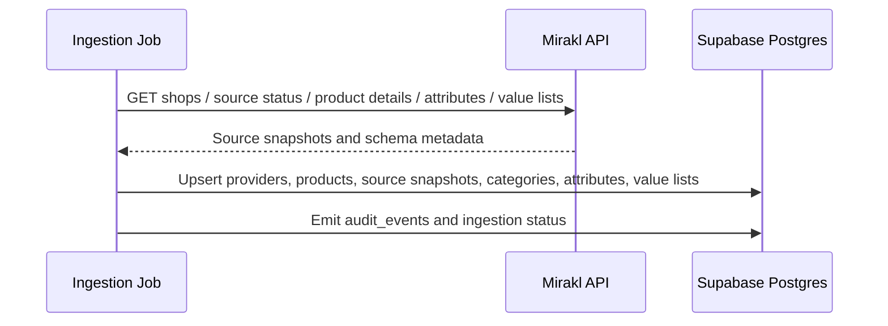
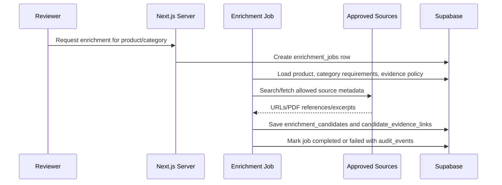
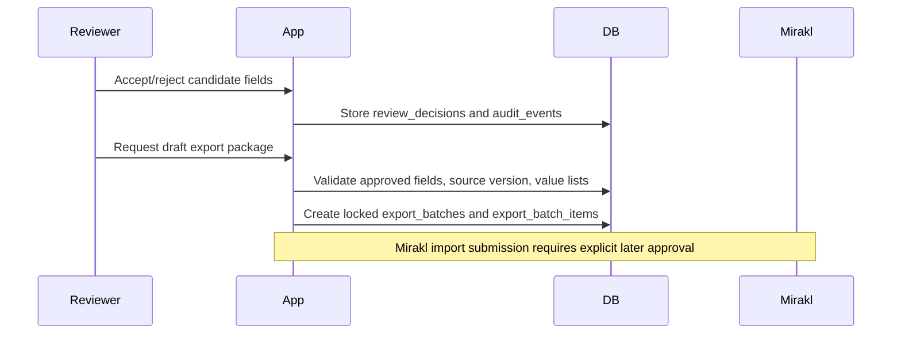
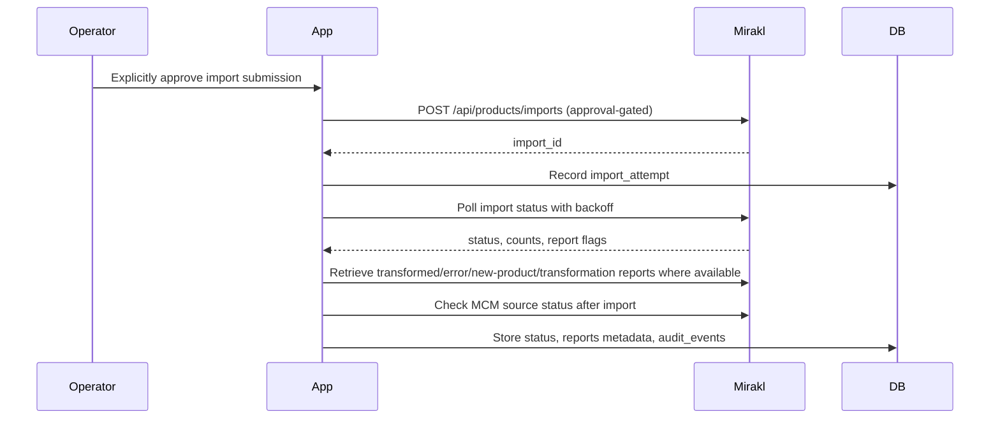

# Architecture: Mirakl Product Enrichment Tool

## Status
Architecture proposal for future implementation. No code has been generated in this milestone.

## Architectural principles
1. Server-only privileged operations: Mirakl tokens, Supabase service role, import package generation, and deployment secrets never run in browser clients.
2. Read/analyze automation before write automation: ingestion, scoring, enrichment, and evidence capture may run after approval; Mirakl write/import/publish remains human-approved.
3. Mirakl source-of-truth: category attributes and value-list constraints are synchronized from Mirakl rather than invented.
4. Field-level auditability: candidates, evidence, decisions, exports, imports, and scores have traceable audit events.
5. shadcn-only interface: dashboard UI is composed from shadcn/ui primitives and application-specific business components only.

## Future high-level components
```text
Browser / Next.js UI
  -> Next.js Server Components / Server Actions / Route Handlers
    -> Supabase Postgres (RLS + audit + storage metadata)
    -> Mirakl API client (server-only)
    -> Enrichment job runner (server-only)
    -> Evidence extraction adapters (policy-gated)
```

## Trust boundaries
| Boundary | Rule |
| --- | --- |
| Browser -> Server | Browser receives only publishable Supabase credentials and serialized safe data. |
| Server -> Mirakl | Mirakl credentials are server-only; all writes/imports are approval-gated. |
| Server -> Supabase | Service-role access is isolated to backend jobs and never exposed to clients. |
| Evidence sources -> App | Source collection obeys `EVIDENCE_POLICY.md`; raw snapshots require approval. |
| Export package -> Mirakl | Draft packages require approval before submission. |

## Sequence: read-only Mirakl ingestion


## Sequence: enrichment candidate generation


## Sequence: review and export preparation


## Sequence: approved Mirakl import follow-up


## Conflict policy
- Mirakl wins when source data changes after candidate generation.
- Accepted candidates become `STALE_REVIEW_REQUIRED` if the source snapshot hash/version changes before export.
- Export batches lock the source snapshot they were generated from.
- Partial import failures create rework items; they do not silently retry mutation.

## Operational architecture defaults
- Start with manual/on-demand enrichment jobs; scheduled batch enrichment is a later controlled enhancement.
- Use materialized scores for list performance and refresh them on ingestion, review decisions, category schema changes, and scheduled freshness checks.
- Keep raw evidence retention approval-gated; default to source metadata and excerpts.

## Architecture acceptance criteria
- All privileged operations are server-only.
- Mirakl mutation paths are explicitly approval-gated.
- Attribute schema drift and stale source snapshots are modeled.
- Evidence, review, export, import, and score events are auditable.
